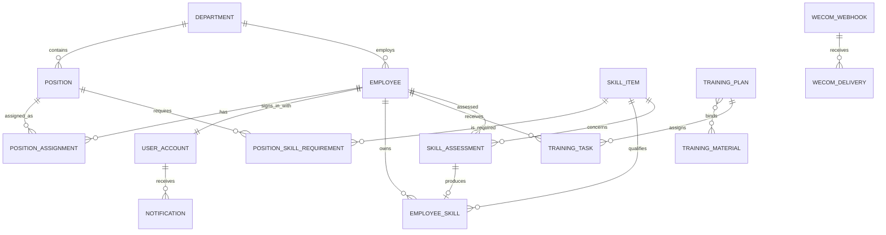

# 技能矩阵系统一期领域模型研究

## 结论

一期应围绕一个最小闭环建模：

`岗位技能标准 -> 培训计划/员工任务 -> 员工提交 -> 负责人确认 -> 技能评定 -> 主管确认 -> HR 归档 -> 员工技能档案与矩阵更新 -> 差距/到期提醒`

系统是单工厂、单租户、响应式 Web 应用。模型只保留形成上述闭环、追溯正式记录和支撑四类核心指标所需的对象；考试、动态工作流、人才推荐和外部系统直连不进入一期。[S1][S2][S3][S4][S5]

## 研究边界与取舍方法

原始需求包含人员、技能、培训、教材、试题、评定、矩阵、复杂统计、移动端和多种外部集成。[S3][S6] 已确认的一期边界对其做了进一步收敛：员工仍独立登录并在线学习，但考核在线下完成；正式培训履历必须经过负责人确认；评定采用固定三级流转；技能类别和能力等级拆分；只保留固定角色、四类指标、站内通知和企业微信群 Webhook。[S1][S2]

本报告按以下优先级解决材料间冲突：

1. 已确认的一期边界和统一业务语言优先于原始需求中的扩展设想。[S1][S2]
2. 流程图用于确认业务顺序和异常分支，但复杂升级审批、PPS 对接和超时升级按一期边界删减。[S4][S5]
3. 原始需求中仍与一期一致、且对闭环或追溯必要的内容保留，例如 Excel 导入、岗位履历、材料附件、有效期和操作日志。[S3]

## 统一术语与固定枚举

### 技能类别

- `GENERAL`：通用技能。
- `PROFESSIONAL`：专业技能。
- `CORE`：核心技能。

类别只表达技能属性，不表达熟练程度。[S1][S2]

### 能力等级

| 值 | 名称 | 业务含义 |
|---:|---|---|
| 0 | 未掌握 | 没有可用能力证明 |
| 1 | 了解 | 理解基础知识，需要指导 |
| 2 | 可独立操作 | 可独立完成标准作业 |
| 3 | 熟练并可指导 | 熟练完成并能指导他人 |
| 4 | 专家 | 能处理复杂问题并改进标准 |

能力等级固定为 0-4；不允许用“通用、初级、中级、高级、专家”同时充当类别与等级。[S1][S2][S6]

## 最小领域实体

### 组织、人员与账号

1. **部门（Department）**
   - 关键字段：编码、名称、启用状态。
   - 关系：拥有多个岗位和员工。

2. **岗位（Position）**
   - 关键字段：编码、名称、所属部门、启用状态。
   - 关系：拥有多条岗位技能要求。

3. **员工（Employee）**
   - 关键字段：工号、姓名、部门、当前岗位、入职日期、必要联系信息、启用状态。
   - 工号是一期登录名和导入时的业务唯一键。

4. **岗位任职记录（PositionAssignment）**
   - 关键字段：员工、部门、岗位、生效时间、结束时间、变更原因。
   - 用于追溯岗位变更；一个员工同一时刻只能有一条当前有效任职记录。

5. **用户账号（UserAccount）**
   - 关键字段：员工或管理用户、登录名、密码摘要、固定角色、首次改密标记、锁定状态、最后登录时间。
   - 员工账号与员工一一对应；管理员可重置密码，用户首次登录必须改密。

来源：[S1][S2][S3]

### 技能标准

6. **技能项（SkillItem）**
   - 关键字段：编码、名称、类别、描述、是否需要复评、默认有效月数、启用状态。
   - 有效期属于技能评定结果，不属于培训记录；技能项只提供默认规则。

7. **岗位技能要求（PositionSkillRequirement）**
   - 关键字段：岗位、技能项、要求等级、是否必备、启用状态。
   - 同一岗位与技能项只能有一条当前有效要求。
   - 一期通过审计日志保留变更痕迹，不建立完整的标准版本发布系统。

8. **员工当前技能（EmployeeSkill）**
   - 关键字段：员工、技能项、当前等级、来源评定、取得日期、到期日期、有效状态。
   - 它是已归档评定形成的当前档案快照；历史事实仍以技能评定记录为准。

来源：[S1][S2][S3][S6]

### 资料与培训

9. **培训资料（TrainingMaterial）**
   - 关键字段：名称、技能项、资料类型、文件位置或外部链接、启用状态。
   - 支持 PDF、Word、PPT、图片和外部视频/网页链接；一期不建立试题库和复杂版本树。

10. **培训计划（TrainingPlan）**
    - 关键字段：名称、目标、适用范围、开始/结束时间、地点、负责人、状态。
    - 关系：绑定一到多份培训资料；发布时生成员工培训任务。

11. **培训任务（TrainingTask）**
    - 关键字段：培训计划、员工、截止时间、状态、提交时间、确认人、确认时间、退回原因。
    - 一名员工在同一培训计划中至多有一条有效任务。

12. **业务附件（Attachment）**
    - 关键字段：文件名、存储键、内容类型、大小、上传人、上传时间、关联业务类型和业务编号。
    - 用于培训签到表、照片、培训记录和评定证据；数据库只保存元数据。

来源：[S1][S2][S3][S4][S5]

### 评定、通知与追溯

13. **技能评定（SkillAssessment）**
    - 关键字段：员工、技能项、评定人、评定方式、评定等级、结果（通过/不通过）、原因与整改建议、有效月数、到期日期、流程状态、主管确认信息、HR 归档信息。
    - 评定方式只记录线下笔试、实操或综合评审；一期不在线组卷或自动阅卷。

14. **站内通知（Notification）**
    - 关键字段：接收用户、事件类型、标题、内容、业务对象、创建时间、已读时间。
    - 员工个人任务、结果和到期信息使用站内通知。

15. **企业微信 Webhook 与发送记录（WeComWebhook / WeComDelivery）**
    - 关键字段：Webhook 名称与密文配置、启用状态；事件唯一键、目标 Webhook、发送状态、尝试次数、响应摘要、下次重试时间。
    - 管理群接收新培训、逾期、到期和待确认提醒。

16. **审计日志（AuditLog）**
    - 关键字段：操作者、动作、业务对象、业务编号、变更前后摘要、时间、客户端信息。
    - 正式业务记录不可物理删除；关键修改、停用、取消、作废和重试必须留痕。

来源：[S1][S2][S3][S4]

## 实体关系



技能矩阵、技能差距、四类 KPI 和员工技能档案页面都是基于上述事实生成的查询视图，不另建可人工编辑的“矩阵实体”或“报表实体”。[S1][S2]

## 状态机

### 基础数据

`ACTIVE -> INACTIVE`

- 部门、岗位、员工、技能项、岗位技能要求、资料和账号采用停用，不物理删除。
- 停用对象不能用于新计划、新任务或新评定；历史引用保持可读。

### 培训计划

```text
DRAFT -> PUBLISHED -> IN_PROGRESS -> COMPLETED
  |          |             |
  +----------+-------------+-> CANCELLED
```

- `DRAFT`：HR/培训管理员或有权主管编辑计划、适用范围和资料。
- `PUBLISHED`：固化当次对象范围并生成员工培训任务、发送通知。
- `IN_PROGRESS`：到达开始时间或已有任务提交。
- `COMPLETED`：所有未取消任务均已确认完成，或负责人在处理完例外后结项。
- `CANCELLED`：保留计划和任务历史，不计入完成率分母。

原需求中的“待上传”不作为独立状态；资料齐备作为发布校验条件。[S2][S3]

### 员工培训任务

```text
ASSIGNED -> SUBMITTED -> CONFIRMED
              |
              +-> RETURNED -> SUBMITTED
ASSIGNED / SUBMITTED / RETURNED -> CANCELLED
```

- 员工只能把自己的 `ASSIGNED` 或 `RETURNED` 任务提交为 `SUBMITTED`。
- 培训负责人或员工所属部门主管可确认；只有 `CONFIRMED` 形成正式培训履历。
- 退回必须填写原因。
- “逾期”是根据截止时间计算的标记，不是会覆盖任务生命周期的独立状态。

来源：[S1][S2][S3][S4][S5]

### 技能评定

评定结论（`PASSED` / `FAILED`）与流程状态分离：

```text
DRAFT -> PENDING_SUPERVISOR -> PENDING_HR -> ARCHIVED
             |                     |
             +------ RETURNED <----+

ARCHIVED -> VOIDED
```

- 评定人录入等级、结论、有效期和证据后提交主管确认。
- 主管确认后进入 HR 待归档；主管或 HR 退回时必须记录原因，评定人修订后重新提交。
- HR 归档后记录不可修改；纠错只能作废并新建评定。
- `FAILED + ARCHIVED` 保留历史和整改建议，但不产生或提升员工当前技能。
- `PASSED + ARCHIVED` 才可更新员工当前技能；需要复评的技能同时产生到期日。

一期删除流程图中的“未达标升级 HR/生产经理共同决策”“必备技能失败升级经理审批”“五日超时逐级升级”等动态分支，调岗和管理决策在线下处理。[S1][S2][S4][S5]

### 员工当前技能有效状态

状态由当前日期计算：

- `VALID`：已归档通过，且无到期日或到期日晚于今天。
- `EXPIRING`：仍有效，但距离到期不超过 30 天。
- `EXPIRED`：到期日早于今天。
- `VOID`：来源评定已作废。

`EXPIRED` 和 `VOID` 均保留历史，但在岗位达标、覆盖率和技能人员名单中不算当前有效能力。[S1][S2][S3]

### 企业微信发送

`PENDING -> SENT`，失败时 `PENDING -> FAILED -> PENDING`（人工重试）。

业务事务与 Webhook 发送解耦；发送失败只写发送记录和站内管理提醒，不回滚培训发布、确认或评定归档。[S1][S2]

## 关键不变量

1. **单工厂且无租户维度**：一期所有数据属于同一部署，不增加 `factoryId`、租户切换或跨工厂权限。
2. **岗位标准唯一**：同一岗位、技能项只有一条当前有效要求，要求等级必须为 0-4。
3. **当前岗位唯一**：同一员工同一时刻只有一条当前有效岗位任职记录。
4. **正式培训需双确认**：员工提交不是完成；只有负责人或主管确认后才能进入培训履历和完成率分子。
5. **培训不自动授予技能**：培训完成只能形成履历，不能直接修改员工技能等级。
6. **评定与归档分离**：只有经过主管确认并由 HR 归档的评定才是正式记录。
7. **失败评定不授予技能**：`FAILED + ARCHIVED` 留档，但不产生有效员工技能。
8. **档案来源可追溯**：每条员工当前技能必须指向一条 `PASSED + ARCHIVED` 且未作废的评定。
9. **到期不达标**：到期或作废技能不计入岗位达标率和覆盖率，但历史不得删除。
10. **等级覆盖规则**：员工有效等级 `>=` 岗位要求等级才算该员工-技能组合达标。
11. **正式记录不可物理删除**：已发布培训、任务确认、评定、归档和发送记录只能取消或作废，并保留原因与审计信息。
12. **停用不破坏历史**：基础数据停用后禁止新引用，但既有业务记录仍可查询和导出。
13. **固定角色**：一期只使用五类固定角色，不允许创建角色或逐权限配置。
14. **个人数据隔离**：员工只能查看和操作本人任务、档案和通知；主管只管理本部门业务；高层只读。
15. **Webhook 非业务一致性边界**：外部发送失败不改变核心业务结果，同一业务事件和目标 Webhook 具备幂等键，避免重复发送。
16. **通知归属清楚**：个人消息必须有站内通知；企业微信只作管理群外部提醒，不作为员工已知悉的唯一证据。

来源：[S1][S2][S3][S4]

## 四类核心指标的统一口径

1. **岗位技能达标率**  
   分子：范围内在岗员工已达到的“必备岗位技能要求”数量；分母：这些员工应满足的全部必备岗位技能要求数量。
2. **部门技能覆盖率**  
   分子：部门岗位中至少有一名当前在岗员工达标的必备“岗位-技能”组合数量；分母：部门全部必备“岗位-技能”组合数量。
3. **培训任务完成率**  
   分子：统计周期内 `CONFIRMED` 的未取消任务；分母：同期已发布的全部未取消任务。
4. **到期数量**  
   分别统计未来 30 天到期和已经到期、且员工仍在岗的员工技能数量。

所有指标均允许从部门下钻至岗位、员工和技能项；导出使用与页面相同的筛选条件和口径。[S1][S2][S3]

## 固定角色与职责

| 角色 | 一期职责 | 明确限制 |
|---|---|---|
| 员工 | 登录、查看本人技能档案/培训履历/评定结果，查看资料，提交本人培训任务，读取通知 | 不查看他人数据；不能自证正式完成 |
| 部门主管 | 查看本部门矩阵和差距，制定本部门培训，确认本部门培训任务，确认技能评定 | 不管理其他部门，不做 HR 最终归档 |
| HR/培训管理员 | 全厂人员与组织导入维护、技能标准、资料、培训计划、评定归档、报表导出 | 不能绕过主管确认直接归档 |
| 高层查看者 | 只读查看全厂 Dashboard、矩阵、下钻和导出 | 不修改业务数据 |
| 系统管理员 | 账号重置、固定角色分配、Webhook、基础配置、审计与系统维护 | 不提供角色设计器；业务审批仍遵守固定流程 |

培训计划指定的负责人可在其计划内完成任务确认；该能力来自业务责任范围，不新增第六种角色。[S1][S2][S3]

## 核心页面

### 共用

1. 登录、首次改密、账号锁定提示。
2. 站内通知中心与个人资料。

### 员工端（响应式）

3. 我的首页：待培训、退回任务、即将到期技能。
4. 我的技能档案：当前技能、等级、有效期、岗位要求与差距。
5. 我的培训：任务列表、资料查看/下载、完成提交、退回原因、培训履历。
6. 我的评定：评定结论、等级、有效期、整改建议。

### 部门主管

7. 部门首页：达标率、覆盖率、培训完成率、到期数量和待确认事项。
8. 部门员工与技能矩阵：部门-岗位-员工-技能下钻、热力表、Excel 导出。
9. 培训计划与任务确认：创建本部门计划、批量参训确认、证据附件、退回。
10. 技能评定确认：查看证据、确认或退回。

### HR/培训管理员

11. 人员与组织：员工/部门/岗位维护、Excel 导入导出、岗位履历。
12. 岗位技能标准：技能项、岗位要求、复制和批量调整。
13. 培训资料库：上传、外链、分类、检索、停用。
14. 全厂培训计划：编辑、发布、取消、任务跟踪与结项。
15. 技能评定与归档：录入/查询、HR 待归档、作废与复评。
16. 全厂 Dashboard、技能矩阵、四类指标和 Excel 导出。

### 系统管理员

17. 账号与固定角色、密码重置。
18. 企业微信 Webhook 配置、测试、发送记录和人工重试。
19. 审计日志查询和基础系统设置。

高层查看者复用只读 Dashboard、矩阵和报表页面，不单独复制功能。[S1][S2][S3]

## 一期验收场景

### 场景 1：真实数据初始化

**给定** 已准备至少 50 名员工、部门和岗位的 Excel 模板  
**当** HR 批量导入并配置至少 3 个岗位及其技能要求  
**那么** 员工、岗位关系和必备等级正确，重复工号或无效岗位被逐行报告且不产生脏数据。

### 场景 2：员工自主学习与双确认

**给定** 已发布一项绑定 PDF/Word/PPT/图片或外链资料的培训计划  
**当** 员工在手机浏览器查看资料并提交完成  
**那么** 任务进入待确认但尚未计入正式培训履历；负责人或主管确认后才进入履历和完成率分子。

### 场景 3：集中培训批量确认

**给定** 一项面向多名员工的集中培训  
**当** 负责人上传签到表或照片并批量确认实际参训员工  
**那么** 仅被确认员工的任务成为正式完成记录，未参训员工仍保持待办或逾期。

### 场景 4：技能评定归档并更新矩阵

**给定** 员工已完成培训，评定人在线下完成考核  
**当** 评定人录入通过结论和等级，部门主管确认，HR 归档  
**那么** 员工当前技能更新，矩阵依据有效等级重新计算达标状态，且完整保留三方操作人和时间。

### 场景 5：不通过与退回

**给定** 一条评定结论为不通过或证据不完整  
**当** 主管/HR 退回，或 HR 最终归档不通过结果  
**那么** 退回原因/整改建议可见；不通过结果可追溯但不授予技能，也不更新达标率。

### 场景 6：有效期与复评

**给定** 某技能需要复评且已归档通过  
**当** 距离到期 30 天或已经到期  
**那么** 员工和管理人员看到站内提醒，管理群收到企业微信提醒；到期后该技能不计入达标率，复评归档后恢复为新的当前有效技能。

### 场景 7：Webhook 故障隔离

**给定** 培训发布或评定归档触发企业微信群提醒  
**当** Webhook 返回失败  
**那么** 核心业务仍成功提交，系统记录失败原因，管理员可幂等重试且不会重复产生业务记录。

### 场景 8：固定角色和越权保护

**给定** 五类角色账号  
**当** 分别访问员工本人、其他员工、本部门、其他部门和全厂数据  
**那么** 员工仅见本人、主管仅管理本部门、HR 管全厂业务、高层只读、系统管理员管理系统配置；越权请求在服务端被拒绝并记入日志。

### 场景 9：指标与导出一致

**给定** 含有效、即将到期、已过期和未掌握技能的测试数据  
**当** 用户查看四类指标并按部门/岗位下钻后导出 Excel  
**那么** 页面、下钻和导出使用相同筛选和公式，已过期或已作废技能不被计为达标。

### 场景 10：上线基线

**给定** 50 名以上真实或脱敏员工和 3 个以上岗位  
**当** 五类角色完成“发布培训 -> 员工提交 -> 负责人确认 -> 录入评定 -> 主管确认 -> HR 归档 -> 矩阵更新”全链路，并发送一次真实企业微信通知  
**那么** 系统连续试运行一周，无阻塞日常使用的严重问题。[S2][S3]

## 一期明确删减项

以下内容不建一期实体、页面或可配置工作流；如需二期开发，优先通过独立模块或适配器接入：

- 在线考试、试题库、题型、组卷、自动阅卷、防作弊和线上成绩。
- 原生 APP、企业微信小程序、扫码/刷卡签到和断网同步。
- SSO、企业微信身份登录、短信/邮件找回密码和个人企业微信精准推送。
- 动态审批流、审批设计器、五日超时逐级升级、HR 与生产经理联合决策、系统内调岗决策。
- 自定义角色、逐项权限设计器、自定义技能分类和自定义等级体系。
- 复杂教材版本树、视频转码平台、精细下载权限和使用频次分析。
- 自定义报表、雷达图、人才画像、人才梯队、岗位候选人智能推荐和预测分析。
- HRIS、MES、PPS 直接集成；一期只保留清晰的导入/导出和未来集成边界。
- 多工厂、多租户、集团汇总和工厂切换；其他工厂使用独立部署。
- 电子签章、数字签名、多语言界面。
- 完整的岗位技能标准版本发布系统；一期以停用、变更留痕和审计日志满足追溯。
- 培训预算核算、培训反馈问卷、证书自动生成和独立证书库。
- 图片格式报表导出；一期只承诺 Excel 导出。
- 复杂阈值预警；一期只做任务逾期和技能到期/过期提醒。

删减并不删除扩展可能：文件存储、通知和未来 MES 集成都应通过适配接口隔离，但一期不为尚未落地的场景增加租户、工作流或考试领域复杂度。[S1][S2][S3][S4]

## 一手材料

- **[S1] 统一业务上下文**：[`D:\dev\jineng\CONTEXT.md`](D:/dev/jineng/CONTEXT.md)
- **[S2] 已确认的一期产品边界（决策 01）**：[`D:\dev\jineng\.scratch\skill-matrix\decisions\01-confirm-phase-one-product-boundary.md`](D:/dev/jineng/.scratch/skill-matrix/decisions/01-confirm-phase-one-product-boundary.md)
- **[S3] 软件开发需求表**：[`D:\dev\jineng\技能矩阵系统\技能矩阵系统\20260630 技能矩阵系统软件开发需求表.docx`](D:/dev/jineng/技能矩阵系统/技能矩阵系统/20260630%20技能矩阵系统软件开发需求表.docx)
- **[S4] 关键岗位技能矩阵流程图文本源**：[`D:\dev\jineng\技能矩阵系统\技能矩阵系统\关键岗位技能矩阵流程图(1).txt`](D:/dev/jineng/技能矩阵系统/技能矩阵系统/关键岗位技能矩阵流程图(1).txt)
- **[S5] 关键岗位技能矩阵流程图（视觉核对）**：[`D:\dev\jineng\技能矩阵系统\技能矩阵系统\关键岗位技能矩阵流程图.png`](D:/dev/jineng/技能矩阵系统/技能矩阵系统/关键岗位技能矩阵流程图.png)、[`D:\dev\jineng\技能矩阵系统\技能矩阵系统\关键岗位技能矩阵流程图.pdf`](D:/dev/jineng/技能矩阵系统/技能矩阵系统/关键岗位技能矩阵流程图.pdf)
- **[S6] 技能矩阵流向与评估记录表（视觉核对）**：[`D:\dev\jineng\技能矩阵系统\技能矩阵系统\20260630 技能矩阵流向图.pdf`](D:/dev/jineng/技能矩阵系统/技能矩阵系统/20260630%20技能矩阵流向图.pdf)
